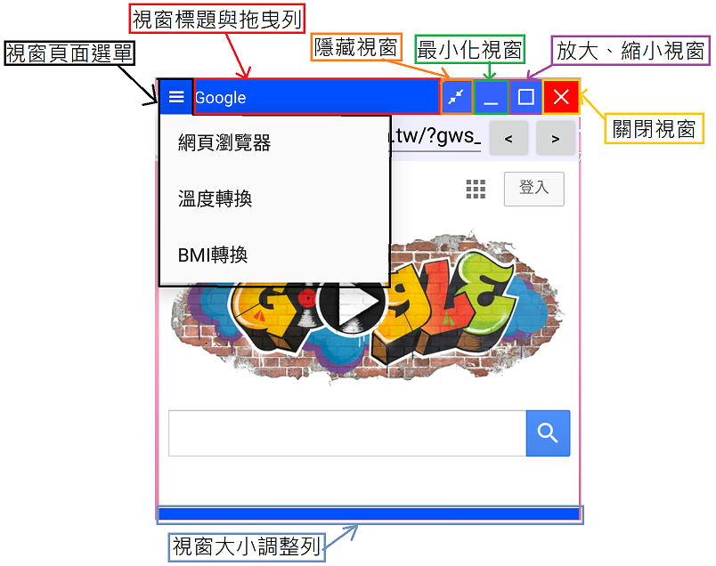

</img>
# FloatWindowCore 浮動視窗核心
Core for floating Window app for Android\


這套核心應用在[FloatWindow 浮動視窗](https://github.com/jack850628/FloatWindow)中。 \
the core use in [FloatWindow](https://github.com/jack850628/FloatWindow)。

  *說明*\
   \
  </img>


## use FloatWindoew use in self App; 使用FloatWindoew在自己的APP裡

1. download 下載[FloatWindow library](https://github.com/jack850628/FloatWindow-Core/releases/)

2. import aar file to your project; 引入aar檔到專案中 
    - first create lib directory in app directory for your project; 先到專案的app資料夾中建立libs \
    </img>
    - and copy floatwindow-release.aar to libs directory; 然後將floatwindow-release.aar複製到libs內

3. add implementation FloatWindow in build.gradle for your project; 在專案的build.gradle中加入對FloatWindow的引用
    ```
    dependencies {
        ...
        implementation files('libs/floatwindow-release.aar')
        ...
    }
    ```

4. at last because FloatWindow has access to the ACTION_MANAGE_OVERLAY_PERMISSION permission, it is necessary to add corresponding processing to the user's request permission in your own APP; 最後，FloatWindow有使用到ACTION_MANAGE_OVERLAY_PERMISSION權限，所以必須在自己的APP中加入跟使用者請求權限的對應處理。

## how to use FloatWindow; FloatWindow的使用方法

call WindowStruct.Builder can create a window; 使用WindowStruct.Builder可以創建一個視窗 \
the easiest way to create a Window is; 創建一個Window最簡單的方式為
```
WindowStruct windowStruct = new WindowStruct.Builder(this,(WindowManager) getSystemService(Context.WINDOW_SERVICE)).show();
```
this will create a Window with blank content; 這樣會創建出一個內容空白的Window \
then; 則
```
WindowStruct windowStruct = new WindowStruct.Builder(this,(WindowManager) getSystemService(Context.WINDOW_SERVICE)).windowPages(new int[]{R.layout.my_layout}).windowPageTitles(new String[]{"My Title"}).show();
```
this will create you a Window with content and title; 這將會為您創建出一個具有內容與標題的Window。

If you want to use some parameters when creating a window, you can do this; 如果想在建立視窗時，帶點參數使用的話，可以這樣做
```
Map<String, Object> args = new HashMap<String, Object>();
args.put("aString", "abc");
args.put("aInteger", 123);

windowStruct.Builder builder = new WindowStruct.Builder(this,(WindowManager) getSystemService(Context.WINDOW_SERVICE));
builder.windowInitArgs(args);//add parameters; 放入參數
builder.constructionAndDeconstructionWindow(new constructionAndDeconstructionWindow(){
    @Override
    public void onCreate(Context context, Map<String, Object> args, WindowStruct windowStruct){
        //you can use parameters in this; 可以在這裡
    }
    @Override
    public void Construction(Context context, View pageView, int position, Map<String, Object> args, WindowStruct windowStruct){
        //and in this; 和這裡接收到參數
    }
});
builder.show();
```

Use WindowColor to set or get the window color; 使用WindowColor可以設定或取得視窗顏色
```
WindowColor windowColor = new WindowColor(this);
int windowBackgroundColor = windowColor.getWindowBackground();//get window background color; 取得視窗背景顏色

windowColor.setTitleBar(0x79afe47a);//ARGB
windowColor.save();//save color change; 儲存顏色設定
```
## WindowStruct Lifecycle (constructionAndDeconstructionWindow)
</img>

## Events that can be listened to in WindowStruet; WindowStruet中可監聽的事件
> - OnWindowTitleChange    ->  when window title changed; 當視窗標題改變
> - OnWindowStateChange    ->  when windiw state changed, ex: to max mini close; 當視窗狀態改變，例如：最大化、最小化、關閉
> - OnWindowSizeChange     ->  when windiw size changed; 當視窗大小改變
> - OnWindowPositionChange -> when windiw position changed; 當視窗位置改變
## Hello World
#### MainActivity.java
```
package com.example.testwindow;

import androidx.annotation.RequiresApi;
import androidx.appcompat.app.AppCompatActivity;

import android.content.Context;
import android.content.Intent;
import android.net.Uri;
import android.os.Build;
import android.os.Bundle;
import android.provider.Settings;
import android.view.View;
import android.view.WindowManager;
import android.widget.EditText;
import android.widget.TextView;

import com.jack8.floatwindow.Window.WindowStruct;

import java.util.Map;


public class MainActivity extends AppCompatActivity {

    @Override
    protected void onCreate(Bundle savedInstanceState) {
        super.onCreate(savedInstanceState);
        setContentView(R.layout.activity_main);
        if (Build.VERSION.SDK_INT>=Build.VERSION_CODES.M&&!Settings.canDrawOverlays(MainActivity.this))
            startActivityForResult(new Intent(Settings.ACTION_MANAGE_OVERLAY_PERMISSION,
                    Uri.parse("package:" + MainActivity.this.getPackageName())), 1);
        else {
            startFloatWindow();
        }

    }
    private void startFloatWindow(){
        findViewById(R.id.hello).setOnClickListener(new View.OnClickListener() {
            @Override
            public void onClick(View v) {
                //create a hello world FloatWindow; 建立一個hello world的FloatWindow視窗
                new WindowStruct.Builder(MainActivity.this, (WindowManager) getSystemService(Context.WINDOW_SERVICE)).
                        windowPages(new int[]{R.layout.hello_page_1, R.layout.hello_page_2}).
                        windowPageTitles(new String[]{"Hello FloatWindow","Submit Hello"}).
                        constructionAndDeconstructionWindow(new WindowStruct.constructionAndDeconstructionWindow() {
                            String helloString = "";
                            @Override
                            public void Construction(Context context, final View view, int i, Map<String, Object> args, final WindowStruct windowStruct) {
                                switch (i){
                                    case 0:
                                        view.findViewById(R.id.get_hello).setOnClickListener(new View.OnClickListener() {
                                            @Override
                                            public void onClick(View v) {
                                                windowStruct.showPage(1);
                                            }
                                        });
                                        break;
                                    case 1:
                                        view.findViewById(R.id.submit).setOnClickListener(new View.OnClickListener() {
                                            EditText helloEdit = view.findViewById(R.id.hello_string);
                                            @Override
                                            public void onClick(View v) {
                                                helloString = helloEdit.getText().toString();
                                                windowStruct.showPage(0);
                                            }
                                        });
                                        break;
                                }
                            }

                            @Override
                            public void Deconstruction(Context context, View view, int i, WindowStruct windowStruct) {

                            }

                            @Override
                            public void onResume(Context context, View view, int i, WindowStruct windowStruct) {
                                if(i == 0)
                                    ((TextView)view.findViewById(R.id.hello_string_view)).setText("Hello " + helloString);
                            }

                            @Override
                            public void onPause(Context context, View view, int i, WindowStruct windowStruct) {

                            }
                        }).show();

            }
        });
    }
    @RequiresApi(api = Build.VERSION_CODES.M)
    @Override
    protected void onActivityResult(int requestCode, int resultCode, Intent data) {
        super.onActivityResult(requestCode, resultCode, data);
        if (requestCode == 1) {
            if (Settings.canDrawOverlays(this))
                startFloatWindow();
            else
                finish();
        }
    }
}
```
#### activity_main.xml
```
<?xml version="1.0" encoding="utf-8"?>
<androidx.constraintlayout.widget.ConstraintLayout xmlns:android="http://schemas.android.com/apk/res/android"
    xmlns:app="http://schemas.android.com/apk/res-auto"
    xmlns:tools="http://schemas.android.com/tools"
    android:layout_width="match_parent"
    android:layout_height="match_parent"
    tools:context=".MainActivity">

    <Button
        android:id="@+id/hello"
        android:layout_width="wrap_content"
        android:layout_height="wrap_content"
        android:text="hello"
        app:layout_constraintBottom_toBottomOf="parent"
        app:layout_constraintEnd_toEndOf="parent"
        app:layout_constraintStart_toStartOf="parent"
        app:layout_constraintTop_toTopOf="parent" />

</androidx.constraintlayout.widget.ConstraintLayout>
```

#### hello_page_1.xml
```
<?xml version="1.0" encoding="utf-8"?>
<LinearLayout xmlns:android="http://schemas.android.com/apk/res/android"
    android:layout_width="match_parent"
    android:layout_height="match_parent"
    android:orientation="vertical">

    <TextView
        android:id="@+id/hello_string_view"
        android:layout_width="match_parent"
        android:layout_height="wrap_content"
        android:gravity="center_horizontal"
        android:text="TextView" />

    <Button
        android:id="@+id/get_hello"
        android:layout_width="match_parent"
        android:layout_height="wrap_content"
        android:text="get hello" />
</LinearLayout>
```
#### hello_page_2.xml
```
<?xml version="1.0" encoding="utf-8"?>
<LinearLayout xmlns:android="http://schemas.android.com/apk/res/android"
    android:layout_width="match_parent"
    android:layout_height="match_parent"
    android:orientation="vertical">

    <EditText
        android:id="@+id/hello_string"
        android:layout_width="match_parent"
        android:layout_height="wrap_content"
        android:ems="10"
        android:hint="your name"
        android:inputType="textPersonName" />

    <Button
        android:id="@+id/submit"
        android:layout_width="match_parent"
        android:layout_height="wrap_content"
        android:text="submit" />
</LinearLayout>
```

## License
使用[MIT license](https://github.com/jack850628/FloatWindow-Core/blob/main/LICENSE)
