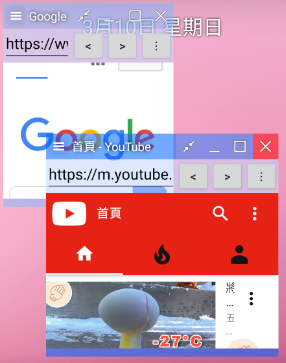

</img>
# FloatWindowCore
[中文說明](./README-zh.md)\
Core for floating Window app for Android\



the core use in [FloatWindow](https://github.com/jack850628/FloatWindow)。

  *Demonstration*\
  </img>


## use FloatWindoew use in self App

1. download [FloatWindow library](https://github.com/jack850628/FloatWindow-Core/releases/)

2. import aar file to your project
    - first create lib directory in app directory for your project \
    </img>
    - and copy floatwindow-release.aar to libs directory

3. add implementation FloatWindow in build.gradle for your project
    ```
    dependencies {
        ...
        implementation files('libs/floatwindow-release.aar')
        ...
    }
    ```

4. at last because FloatWindow has access to the ACTION_MANAGE_OVERLAY_PERMISSION permission, it is necessary to add corresponding processing to the user's request permission in your own APP

## How to use FloatWindow

call WindowStruct.Builder can create a window \
the easiest way to create a Window is
```
WindowStruct windowStruct = new WindowStruct.Builder(this,(WindowManager) getSystemService(Context.WINDOW_SERVICE)).show();
```
this will create a Window with blank content \
then
```
WindowStruct windowStruct = new WindowStruct.Builder(this,(WindowManager) getSystemService(Context.WINDOW_SERVICE)).windowPages(new int[]{R.layout.my_layout}).windowPageTitles(new String[]{"My Title"}).show();
```
this will create you a Window with content and title

If you want to use some parameters when creating a window, you can do this
```
Map<String, Object> args = new HashMap<String, Object>();
args.put("aString", "abc");
args.put("aInteger", 123);

windowStruct.Builder builder = new WindowStruct.Builder(this,(WindowManager) getSystemService(Context.WINDOW_SERVICE));
builder.windowInitArgs(args);//add parameters
builder.constructionAndDeconstructionWindow(new constructionAndDeconstructionWindow(){
    @Override
    public void onCreate(Context context, Map<String, Object> args, WindowStruct windowStruct){
        //you can use parameters in this
    }
    @Override
    public void Construction(Context context, View pageView, int position, Map<String, Object> args, WindowStruct windowStruct){
        //and in this
    }
});
builder.show();
```

Use WindowColor to set or get the window color
```
WindowColor windowColor = new WindowColor(this);
int windowBackgroundColor = windowColor.getWindowBackground();//get window background color

windowColor.setTitleBar(0x79afe47a);//ARGB
windowColor.save();//save color change
```
## com.jack8.floatwindow.Window.WindowManager
Hereinafter referred to as WindowManager. WindowManager contains all the windows that have not been closed yet. If you want to obtain all the unclosed windows, you can use the WindowManager.entrySet() method:
```
Set<Map.Entry<Integer, WindowStruct>> allWindows = WindowManager.entrySet();//<Number, Window>
```
Each window has its own number, which can be obtained using WindowStruct.getNumber():
```
int windowNumber = new WindowStruct.Builder(this,(WindowManager) getSystemService(Context.WINDOW_SERVICE)).show().getNumber();
```
You can obtain a window using WindowManager.getWindowStruct():
```
WindowStruct window = WindowManager.getWindowStruct(windowNumber);
```
Therefore, it is recommended that you do not need to maintain a reference to WindowStruct. You only need to maintain the Number of each window and obtain the WindowStruct from WindowManager when needed.

## Sub Window
If you need to create a new window to cover the old window to block the user from operating the old window (such as an Alert Window), you can use WindowStruct.Builder.parentWindow() when creating WindowStruct:
```
WindowStruct mainWindow = new WindowStruct.Builder(this,(WindowManager) getSystemService(Context.WINDOW_SERVICE)).show();

WindowStruct alertWindow = new WindowStruct.Builder(this,(WindowManager) getSystemService(Context.WINDOW_SERVICE))
    .parentWindow(mainWindow)
    .show();
```
In addition, a window can have multiple sub-windows, and you can obtain all sub-windows using WindowStruct.getSubWindow():
```
List<WindowStruct> subWindows = mainWindow.getSubWindow();
```

## Window Control Object
You can adjust which window control objects to display when creating a window (such as Maximize Button, Title Bar, Size Adjustment Bar):
```
WindowStruct alertWindow = new WindowStruct.Builder(this,(WindowManager) getSystemService(Context.WINDOW_SERVICE))
    .displayObject(WindowStruct.TITLE_BAR_AND_BUTTONS | WindowStruct.CLOSE_BUTTON)
    .show();
```
Or adjust after creation:
```
alertWindow.setDisplayObject(alertWindow.getDisplayObject() | WindowStruct.MINI_BUTTON);
```
The following are all available Control Objects:
- ALL_NOT_DISPLAY
- MENU_BUTTON
- HIDE_BUTTON
- MINI_BUTTON
- MAX_BUTTON
- CLOSE_BUTTON
- SIZE_BAR
- TITLE_BAR_AND_BUTTONS
- FULLSCREEN_BUTTON

## WindowStruct Lifecycle (constructionAndDeconstructionWindow)
</img>

## Events that can be listened to in WindowStruet
> - OnWindowTitleChange    ->  when window title changed
> - OnWindowStateChange    ->  when windiw state changed, ex: to max mini close
> - OnWindowSizeChange     ->  when windiw size changed
> - OnWindowPositionChange -> when windiw position changed
## Hello World
#### MainActivity.java
```
package com.example.testwindow;

import androidx.annotation.RequiresApi;
import androidx.appcompat.app.AppCompatActivity;

import android.content.Context;
import android.content.Intent;
import android.net.Uri;
import android.os.Build;
import android.os.Bundle;
import android.provider.Settings;
import android.view.View;
import android.view.WindowManager;
import android.widget.EditText;
import android.widget.TextView;

import com.jack8.floatwindow.Window.WindowStruct;

import java.util.Map;


public class MainActivity extends AppCompatActivity {

    @Override
    protected void onCreate(Bundle savedInstanceState) {
        super.onCreate(savedInstanceState);
        setContentView(R.layout.activity_main);
        if (Build.VERSION.SDK_INT>=Build.VERSION_CODES.M&&!Settings.canDrawOverlays(MainActivity.this))
            startActivityForResult(new Intent(Settings.ACTION_MANAGE_OVERLAY_PERMISSION,
                    Uri.parse("package:" + MainActivity.this.getPackageName())), 1);
        else {
            startFloatWindow();
        }

    }
    private void startFloatWindow(){
        findViewById(R.id.hello).setOnClickListener(new View.OnClickListener() {
            @Override
            public void onClick(View v) {
                //create a hello world FloatWindow
                new WindowStruct.Builder(MainActivity.this, (WindowManager) getSystemService(Context.WINDOW_SERVICE)).
                        windowPages(new int[]{R.layout.hello_page_1, R.layout.hello_page_2}).
                        windowPageTitles(new String[]{"Hello FloatWindow","Submit Hello"}).
                        constructionAndDeconstructionWindow(new WindowStruct.constructionAndDeconstructionWindow() {
                            String helloString = "";
                            @Override
                            public void Construction(Context context, final View view, int i, Map<String, Object> args, final WindowStruct windowStruct) {
                                switch (i){
                                    case 0:
                                        view.findViewById(R.id.get_hello).setOnClickListener(new View.OnClickListener() {
                                            @Override
                                            public void onClick(View v) {
                                                windowStruct.showPage(1);
                                            }
                                        });
                                        break;
                                    case 1:
                                        view.findViewById(R.id.submit).setOnClickListener(new View.OnClickListener() {
                                            EditText helloEdit = view.findViewById(R.id.hello_string);
                                            @Override
                                            public void onClick(View v) {
                                                helloString = helloEdit.getText().toString();
                                                windowStruct.showPage(0);
                                            }
                                        });
                                        break;
                                }
                            }

                            @Override
                            public void Deconstruction(Context context, View view, int i, WindowStruct windowStruct) {

                            }

                            @Override
                            public void onResume(Context context, View view, int i, WindowStruct windowStruct) {
                                if(i == 0)
                                    ((TextView)view.findViewById(R.id.hello_string_view)).setText("Hello " + helloString);
                            }

                            @Override
                            public void onPause(Context context, View view, int i, WindowStruct windowStruct) {

                            }
                        }).show();

            }
        });
    }
    @RequiresApi(api = Build.VERSION_CODES.M)
    @Override
    protected void onActivityResult(int requestCode, int resultCode, Intent data) {
        super.onActivityResult(requestCode, resultCode, data);
        if (requestCode == 1) {
            if (Settings.canDrawOverlays(this))
                startFloatWindow();
            else
                finish();
        }
    }
}
```
#### activity_main.xml
```
<?xml version="1.0" encoding="utf-8"?>
<androidx.constraintlayout.widget.ConstraintLayout xmlns:android="http://schemas.android.com/apk/res/android"
    xmlns:app="http://schemas.android.com/apk/res-auto"
    xmlns:tools="http://schemas.android.com/tools"
    android:layout_width="match_parent"
    android:layout_height="match_parent"
    tools:context=".MainActivity">

    <Button
        android:id="@+id/hello"
        android:layout_width="wrap_content"
        android:layout_height="wrap_content"
        android:text="hello"
        app:layout_constraintBottom_toBottomOf="parent"
        app:layout_constraintEnd_toEndOf="parent"
        app:layout_constraintStart_toStartOf="parent"
        app:layout_constraintTop_toTopOf="parent" />

</androidx.constraintlayout.widget.ConstraintLayout>
```

#### hello_page_1.xml
```
<?xml version="1.0" encoding="utf-8"?>
<LinearLayout xmlns:android="http://schemas.android.com/apk/res/android"
    android:layout_width="match_parent"
    android:layout_height="match_parent"
    android:orientation="vertical">

    <TextView
        android:id="@+id/hello_string_view"
        android:layout_width="match_parent"
        android:layout_height="wrap_content"
        android:gravity="center_horizontal"
        android:text="TextView" />

    <Button
        android:id="@+id/get_hello"
        android:layout_width="match_parent"
        android:layout_height="wrap_content"
        android:text="get hello" />
</LinearLayout>
```
#### hello_page_2.xml
```
<?xml version="1.0" encoding="utf-8"?>
<LinearLayout xmlns:android="http://schemas.android.com/apk/res/android"
    android:layout_width="match_parent"
    android:layout_height="match_parent"
    android:orientation="vertical">

    <EditText
        android:id="@+id/hello_string"
        android:layout_width="match_parent"
        android:layout_height="wrap_content"
        android:ems="10"
        android:hint="your name"
        android:inputType="textPersonName" />

    <Button
        android:id="@+id/submit"
        android:layout_width="match_parent"
        android:layout_height="wrap_content"
        android:text="submit" />
</LinearLayout>
```

## License
[MIT license](https://github.com/jack850628/FloatWindow-Core/blob/main/LICENSE)
